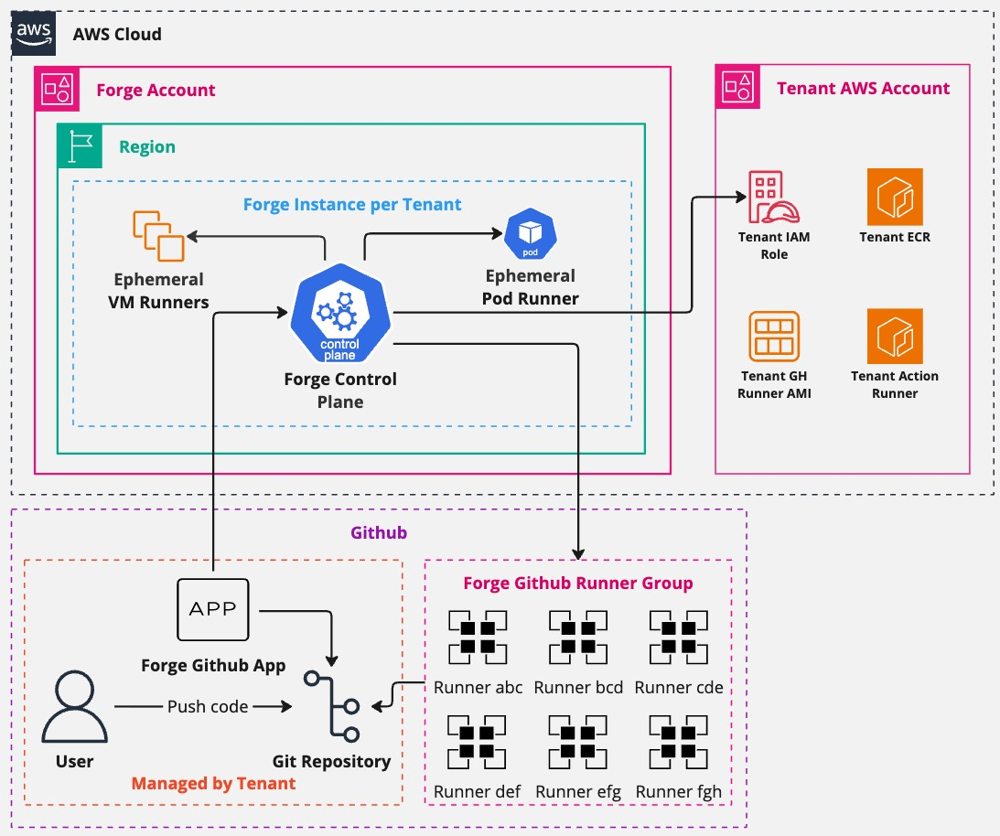

# ForgeMT

[](https://github.com/cisco-open/forge/releases/latest/)
[](LICENSE.md)
[](https://opensource.cisco.com)
[](https://cisco-open.github.io/forge/)
[](https://scorecard.dev/viewer/?uri=github.com/cisco-open/forge)
[](https://www.bestpractices.dev/projects/10905)


[](https://github.com/cisco-open/forge/graphs/contributors)

ForgeMT is a multi-tenant GitHub Actions runner platform for AWS. The public
project name is ForgeMT for searchability; operators often shorten it to Forge
after the context is clear.

ForgeMT helps platform teams run ephemeral EC2 and Kubernetes/ARC runners,
onboard tenants through reviewed IaC changes, and keep runner operations in
repeatable repos and pipelines instead of one-off scripts.



## When To Use It

Use ForgeMT when you need:

- GitHub Actions runners inside your AWS accounts.
- tenant boundaries for labels, IAM roles, networks, images, and runner specs.
- EC2 runner support for full VM control, custom AMIs, Windows, macOS, or heavy
  builds.
- ARC runner support for Kubernetes-based runner scale sets.
- copyable operations for runner images, ECR images, cleanup, Renovate, and
  weekly apply/destroy validation.

Do not start by deploying every module. The smallest useful install is one
GitHub.com organization, one tenant, one runner lane, and one smoke workflow.
Add helpers, EKS, Splunk, Teleport, OpenCost, OpenTelemetry, and webhook relay
modules only when your operating model needs them.

## Module Layout

ForgeMT modules are grouped by operating responsibility:

| Category       | Path                       | Purpose                                                          |
| -------------- | -------------------------- | ---------------------------------------------------------------- |
| Platform       | `modules/platform`         | Forge runtime modules for EC2 and ARC tenant runners.            |
| Infrastructure | `modules/infra`            | EKS foundation for ARC/Kubernetes runner scale sets.             |
| Helpers        | `modules/helpers`          | Account preparation and operations helpers such as AMI, ECR, S3. |
| Integrations   | `modules/integrations`     | Optional external systems such as Splunk, Teleport, and relays.  |
| Examples       | `examples/deployments/...` | Functional Terragrunt roots grouped like the module layout.      |

Splunk is optional. If your company does not use Splunk, skip the Splunk
example folders and all `modules/integrations/splunk_*` modules.

## Quick Start

Start with the documentation site:

- [ForgeMT documentation](https://cisco-open.github.io/forge/)
- [Motivation](./docs/motivation.md)
- [Architecture](./docs/architecture.md)
- [Platform Engineer Quick Start](./docs/getting-started/platform-engineer.md)
- [Bootstrap](./docs/getting-started/bootstrap.md)
- [Minimal Install](./docs/getting-started/minimal-install.md)
- [Examples](./docs/examples/index.md)
- [Operations](./docs/operations/index.md)
- [Security](./docs/security.md)

The first install path uses:

```text
examples/deployments/platform
```

Copy it into your operations IaC repo, replace the AWS and GitHub values, create
the GitHub App key parameter, store the real base64 PEM in SSM, then run:

```bash
cd examples/deployments/platform/terragrunt/environments/prod/regions/eu-west-1/vpcs/main/tenants/acme
terragrunt init
terragrunt plan
terragrunt apply
```

For the full sequence, including backend bootstrap and GitHub App registration,
use [Bootstrap](./docs/getting-started/bootstrap.md) and
[Minimal Install](./docs/getting-started/minimal-install.md).

## Tenant Usage

After the platform team onboards a tenant, repository owners request the runner
with labels generated by ForgeMT:

```yaml
---
name: Forge smoke

on:
  workflow_dispatch:

jobs:
  smoke:
    runs-on:
      - self-hosted
      - type:small
      - x64
      - ec2
      - tnt:acme
    steps:
      - run: echo "Forge runner is online"
```

Tenant teams should use [Tenant Usage](./docs/tenant-usage/index.md) for label,
AWS role, ECR, and troubleshooting patterns.

## Learn More

Technical background:

- [No Silver Bullets: Engineering a Multi-Tenant CI Platform a Small Team Can Run](https://dev.to/edersonbrilhante/no-silver-bullets-engineering-a-multi-tenant-ci-platform-a-small-team-can-run-if)
- [Forge: scalable, secure multi-tenant GitHub runner platform](https://www.linkedin.com/pulse/forge-scalable-secure-multi-tenant-github-runner-brilhante--fyxbf)
- [Scaling GitHub Actions on AWS with ForgeMT's security and multi-tenancy](https://hackernoon.com/scaling-github-actions-on-aws-with-forgemts-security-and-multi-tenancy)
- [No Silver Bullets: engineering a multi-tenant CI platform a small team can run](https://www.linkedin.com/pulse/silver-bullets-engineering-multi-tenant-ci-platform-small-brilhante-ofjpf/)

Implementation foundations:

- [terraform-aws-github-runner](https://github.com/github-aws-runners/terraform-aws-github-runner)
- [actions-runner-controller](https://github.com/actions/actions-runner-controller)

## Contributing

Contributions are welcome via issues or pull requests. See
[CONTRIBUTING.md](CONTRIBUTING.md) for details.

## License

Apache 2.0. See [LICENSE](LICENSE).

## Contact

Track progress or open issues on GitHub:
[https://github.com/cisco-open/forge/issues](https://github.com/cisco-open/forge/issues)
