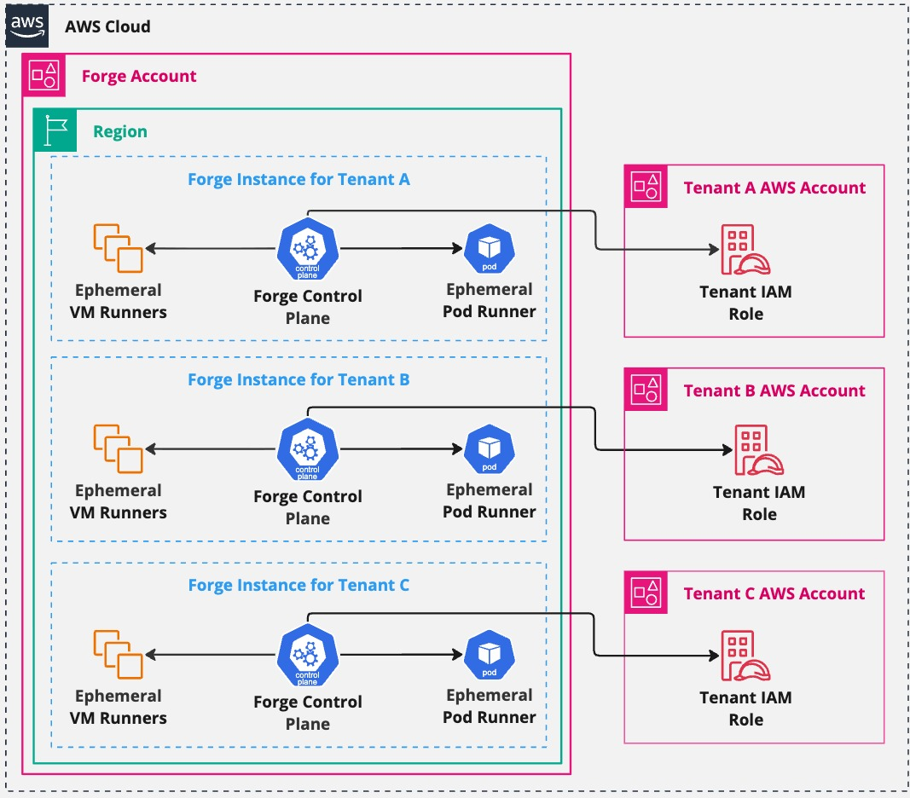
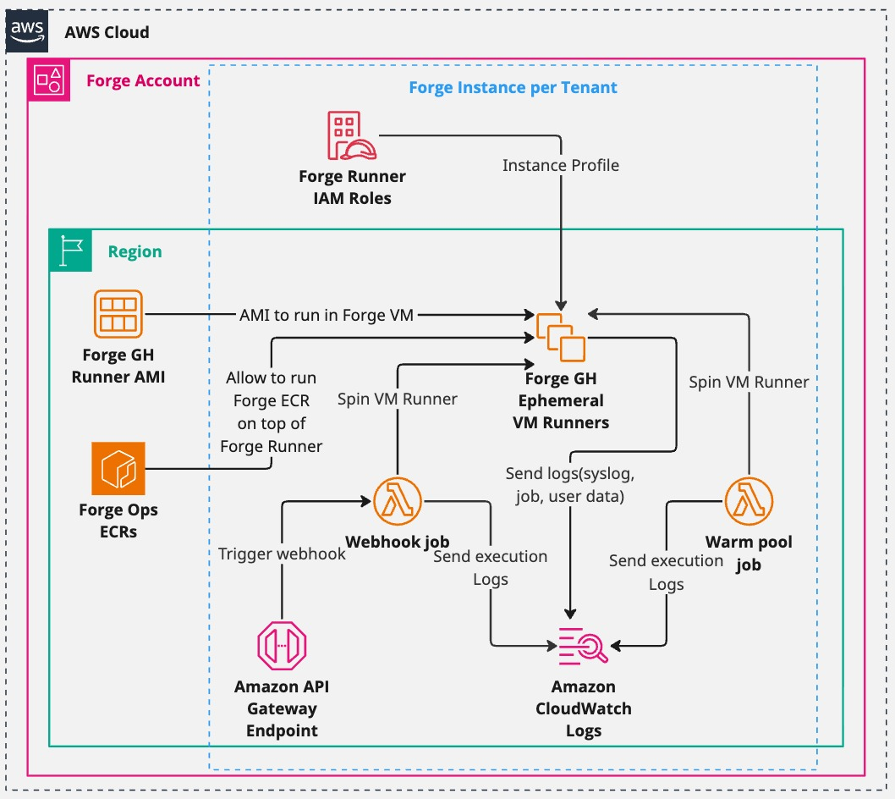
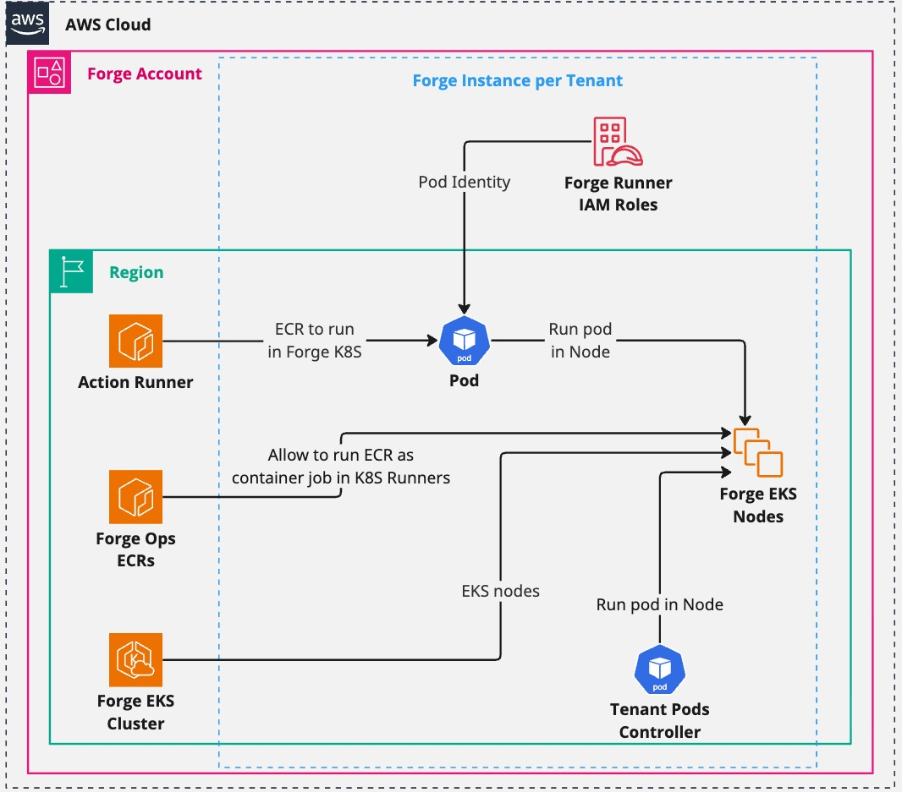

# Architecture

Forge is organized around a simple operating model:

- platform modules run the Forge runner runtime
- infra modules provide EKS only when ARC runners are used
- helper modules prepare and maintain accounts
- integration modules connect Forge to external systems when the company uses
  them

## Vocabulary

| Term             | Meaning                                                                                                         |
| ---------------- | --------------------------------------------------------------------------------------------------------------- |
| ForgeMT          | The open-source product name: Forge multi-tenancy.                                                              |
| Forge            | Short name used in prose and by operators after the product is clear.                                           |
| Tenant           | The isolation and configuration boundary for a team: labels, runner settings, GitHub App scope, and AWS access. |
| Ephemeral runner | A runner created for a job and removed after the job or cleanup cycle.                                          |
| Control plane    | The platform-owned system that receives events, provisions runners, manages identity, and collects signals.     |
| Tenant plane     | Where tenant jobs execute on EC2 instances or ARC pods.                                                         |
| EC2 lane         | Runner execution on full AWS instances for VM-level control, custom AMIs, macOS, Windows, or heavy builds.      |
| ARC lane         | Runner execution on Kubernetes pods through Actions Runner Controller.                                          |
| Labels           | The API contract between tenant workflows and ForgeMT runner capacity.                                          |

The most important mental model is shared platform, isolated execution. Tenants
share one platform and upgrade path, but their jobs run behind explicit labels,
IAM roles, network placement, and runner specs.

## Deployment Categories

| Category       | Main path                         | Purpose                                                                                 | Required for first tenant? |
| -------------- | --------------------------------- | --------------------------------------------------------------------------------------- | -------------------------- |
| Platform       | `modules/platform/forge_runners`  | Tenant-facing runner runtime for EC2 and ARC runner specs.                              | Yes                        |
| Infrastructure | `modules/infra/eks`               | EKS foundation for ARC scale sets, including Kubernetes add-ons used by Forge.          | Only for ARC               |
| Helpers        | `modules/helpers/*`               | Account preparation and operations support such as AMIs, ECR, S3, cleanup, and regions. | Sometimes                  |
| Integrations   | `modules/integrations/*`          | Optional Splunk, Teleport, OpenCost, OpenTelemetry, and relay destination modules.      | No                         |
| Examples       | `examples/deployments/<category>` | Terragrunt deployment roots that mirror the module categories.                          | Platform only              |

See [Module Layout](reference/module-layout.md) for the full path map.

## Control Plane And Tenant Plane

Forge separates control-plane ownership from tenant usage.

The platform team owns:

- Forge module versions and release metadata
- AWS accounts, state, deployment roles, and bootstrap decisions
- GitHub App credentials and webhook configuration
- runner AMIs and ARC container images
- tenant onboarding, runner labels, and AWS role access
- optional integrations and day-2 cleanup jobs

Tenant teams consume:

- GitHub Actions runner labels
- documented AWS roles they can assume from jobs
- approved runner images and toolchains
- support from the platform team when jobs fail to start or access AWS

Tenant repos should not need to know how Forge deploys its runtime.

## EC2 Runner Lane

Use the EC2 lane when jobs need full VM isolation, custom AMIs, Docker builds,
or operating-system level tooling.

Runtime shape:

1. A GitHub workflow requests a Forge runner label.
1. GitHub sends a signed webhook event to the Forge runner platform.
1. Forge evaluates labels and tenant metadata.
1. The EC2 runner deployment creates an ephemeral runner from the configured
   AMI, subnet, security groups, and runner settings.
1. The job assumes tenant AWS roles through OIDC instead of long-lived AWS
   keys.
1. The runner is removed after the job or cleanup cycle.

Start here for the smallest first deployment:
[Configure Platform](getting-started/configure-platform.md).

## ARC Runner Lane

Use the ARC lane when jobs fit a container runner model and the platform team
wants Kubernetes scheduling, Karpenter capacity management, and shared EKS
operations.

Runtime shape:

1. `modules/infra/eks` creates or manages the EKS foundation used by Forge.
1. `modules/platform/arc` and `modules/platform/arc_deployment` install and
   configure ARC components and scale sets.
1. Tenant runner specs select namespaces, labels, images, and runner settings.
1. Jobs run in ARC-managed pods and use AWS identity controls configured by the
   platform.

Skip EKS when the first tenant uses only EC2 runner specs. Add it when a tenant
has `arc_runner_specs` or the company standardizes CI workloads on Kubernetes.

For production ARC installations, operate EKS as blue/green cluster pairs. The
tenant's `arc_cluster_name` selects the active cluster for that tenant, and
`migrate_arc_cluster` is used only during a planned tenant move. This lets the
platform team rebuild EKS and ARC foundations without editing tenant workflow
labels.

## Helper Layer

Helpers are not the runner runtime. They support the operating model.

| Helper family          | Typical owner       | Why it exists                                               |
| ---------------------- | ------------------- | ----------------------------------------------------------- |
| AMI policy and sharing | runner image team   | publish, share, and govern base or custom runner AMIs       |
| ECR                    | container team      | store runner, pre-commit, sidecar, or lambda images         |
| Storage                | platform team       | store artifacts, templates, logs, and integration files     |
| Service-linked roles   | account bootstrap   | prepare AWS services such as EC2 Spot                       |
| Opt-in regions         | account bootstrap   | enable regions before module deployments                    |
| Cloud Custodian        | operations team     | remove stale AMIs, old runners, and leftover resources      |
| Forge subscription     | tenant onboarding   | create tenant-side access used by Forge-managed jobs        |
| CloudFormation helpers | integration support | provide admin/execution roles for CloudFormation-based work |

Use [Configure Helpers](getting-started/configure-helpers.md) to decide what to
copy and what to delete from your operating repo.

## Optional Integrations

Integrations should be deployed after the platform runner path is proven.

Splunk modules can add dashboards, billing ingestion, OpenTelemetry,
OpenCost, S3 runner logs, and stuck-workflow redelivery. Teleport can support
operator access. Webhook relay destination modules can centralize forwarding to
external receivers.

If your company does not use one of those systems, skip that example folder and
module family. Forge does not require Splunk or Teleport to run a tenant.

## Day-2 Operating Loop

Forge is kept healthy by testing the same paths that users copy:

1. Build or select runner AMIs and container images.
1. Update helper and platform release metadata.
1. Plan and apply helpers, infra, platform, then integrations.
1. Run smoke workflows on EC2 and ARC labels that are enabled.
1. Destroy weekly validation stacks in reverse order.
1. Let cleanup, Renovate, and image pipelines keep drift visible.

The copyable operating repo shapes live in
[Repo Blueprints](operations/repo-blueprints/index.md).
